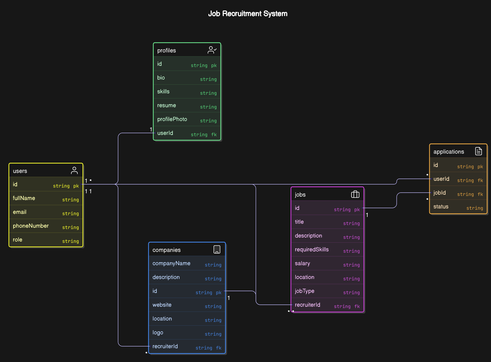

# Job Application System

This project is a Job Application System built with **Node.js**, **Express**, and **MongoDB** using **Mongoose**. The system allows users to register as either **students** or **recruiters**, and includes features such as job listings, job applications, and company management.

## Features

- **User Authentication**: User registration, login, and profile management using JWT authentication.
- **Company Management**: Recruiters can create, update, and delete their companies.
- **Job Listings**: Recruiters can post jobs, and students can apply for them.
- **Job Applications**: Students can apply for jobs, and recruiters can view and manage applications.
- **Role-based Access**: Different functionalities for students and recruiters.
- **Image Optimization**: Optimize images using AWS Lambda.
- **Docker Support**: Containerize the application for easy deployment.
- **Redis Caching**: Improve application performance with Redis caching.
- **Dockerized Services**: Use Docker to containerize Redis, MongoDB, and the backend for better scalability.

## Tech Stack

- **Backend**: Node.js, Express.js
- **Database**: MongoDB, Mongoose
- **Authentication**: JWT (JSON Web Token)
- **File Storage**: AWS S3 (for file uploads, if implemented in the future)
- **Environment Configuration**: dotenv
- **Caching**: Redis
- **Image Optimization & Resizing**: AWS Lambda
- **Containerization**: Docker

## Installation

### Prerequisites

- Node.js (>=14.x)
- MongoDB (local or cloud instance)
- Redis (for caching, optional but recommended)
- Docker (for containerized deployment, optional)
- AWS Account (for S3 and Lambda, optional)

### Steps to Install

1. Clone the repository:

   ```bash
   git clone https://github.com/your-repo/job-application-system.git
   ```

2. Navigate into the project directory:

   ```bash
   cd job-application-system
   ```

3. Install dependencies:

   ```bash
   npm install
   ```

4. Set up environment variables:
   Create a `.env` file in the root of the project and add the following:

   ```plaintext
   MONGODB_URI=your_mongo_connection_string
   JWT_SECRET=your_jwt_secret
   ```

5. Start the server:

   ```bash
   npm start
   ```

   The server will be running at `http://localhost:5000` by default.

## API Endpoints

### User Routes

- **POST** `/api/users/register` - Register a new user (Student/Recruiter)
- **POST** `/api/users/login` - Login with credentials
- **GET** `/api/users/profile` - Get the authenticated user's profile (Requires Authentication)
- **PATCH** `/api/users/profile/update` - Update the authenticated user's profile (Requires Authentication)

### Company Routes (For Recruiters)

- **POST** `/api/companies/register` - Register a new company (Requires Authentication)
- **PATCH** `/api/companies/:id` - Update a company's details (Requires Authentication)
- **DELETE** `/api/companies/:id` - Delete a company (Requires Authentication)
- **GET** `/api/companies` - Get all companies
- **GET** `/api/companies/:id` - Get a company by ID
- **GET** `/api/companies/my` - Get companies created by the authenticated recruiter (Requires Authentication)

### Job Routes (For Recruiters)

- **POST** `/api/jobs/add` - Post a new job (Requires Authentication)
- **PATCH** `/api/jobs/:id` - Update a job by ID (Requires Authentication)
- **DELETE** `/api/jobs/:id` - Delete a job by ID (Requires Authentication)
- **GET** `/api/jobs` - Get all jobs
- **GET** `/api/jobs/my` - Get jobs posted by the authenticated recruiter (Requires Authentication)

### Application Routes (For Students)

- **POST** `/api/applications/apply/:id` - Apply for a job (Requires Authentication)
- **GET** `/api/applications/my` - Get all applications made by the authenticated student (Requires Authentication)

### Application Routes (For Recruiters)

- **GET** `/api/applications` - Get all applications for the recruiter's jobs (Requires Authentication)
- **GET** `/api/applications/:id` - Get a specific application by ID (Requires Authentication)
- **PATCH** `/api/applications/:id/status` - Update the status of an application (Requires Authentication)

### Authentication Middleware

Authentication is done via JWT. Protect routes with the `authMiddleware` which ensures that the user is authenticated.

### File Uploads (Optional)

If AWS S3 or another file storage system is integrated, you can upload files such as company logos or job-related documents. The necessary logic would be handled in the `updateCompanyById` route.

## Database Models

### User Model

```js
const UserSchema = new mongoose.Schema({
  fullName: { type: String, required: true },
  gender: { type: String, required: true },
  email: { type: String, required: true, unique: true },
  phoneNumber: { type: String, required: true },
  password: { type: String, required: true },
  role: { type: String, enum: ["student", "recruiter"], required: true },
  profile: { type: String }, // URL to profile picture
});
```

### Company Model

```js
const CompanySchema = new mongoose.Schema({
  name: { type: String, required: true, unique: true },
  userId: { type: mongoose.Schema.Types.ObjectId, ref: "User", required: true },
  description: { type: String },
  website: { type: String },
  location: { type: String },
  logo: { type: String }, // URL to company logo (optional)
});
```

### Job Model

```js
const JobSchema = new mongoose.Schema({
  title: { type: String, required: true },
  description: { type: String, required: true },
  requirements: { type: String },
  salary: { type: String },
  location: { type: String },
  jobType: { type: String },
  position: { type: String },
  experience: { type: String },
  company: {
    type: mongoose.Schema.Types.ObjectId,
    ref: "Company",
    required: true,
  },
  createdBy: {
    type: mongoose.Schema.Types.ObjectId,
    ref: "User",
    required: true,
  },
  status: { type: String, enum: ["open", "closed"], default: "open" },
  applications: [{ type: mongoose.Schema.Types.ObjectId, ref: "Application" }],
});
```

### Application Model

```js
const ApplicationSchema = new mongoose.Schema({
  job: { type: mongoose.Schema.Types.ObjectId, ref: "Job", required: true },
  applicant: {
    type: mongoose.Schema.Types.ObjectId,
    ref: "User",
    required: true,
  },
  status: {
    type: String,
    enum: ["pending", "accepted", "rejected", "closed"],
    default: "pending",
  },
});
```

## ER Diagram



## Error Handling

- All endpoints return appropriate HTTP status codes:
  - `200 OK`: Request was successful.
  - `201 Created`: Resource was successfully created.
  - `400 Bad Request`: Invalid data or missing parameters.
  - `404 Not Found`: Resource not found.
  - `500 Internal Server Error`: An error occurred on the server side.

## Contributing

1. Fork the repository.
2. Create your feature branch (`git checkout -b feature/feature-name`).
3. Commit your changes (`git commit -am 'Add new feature'`).
4. Push to the branch (`git push origin feature/feature-name`).
5. Create a new Pull Request.

## License

This project is licensed under the MIT License - see the [LICENSE](LICENSE.txt) file for details.

---

**Enjoy using the Job Application System!** 🚀
